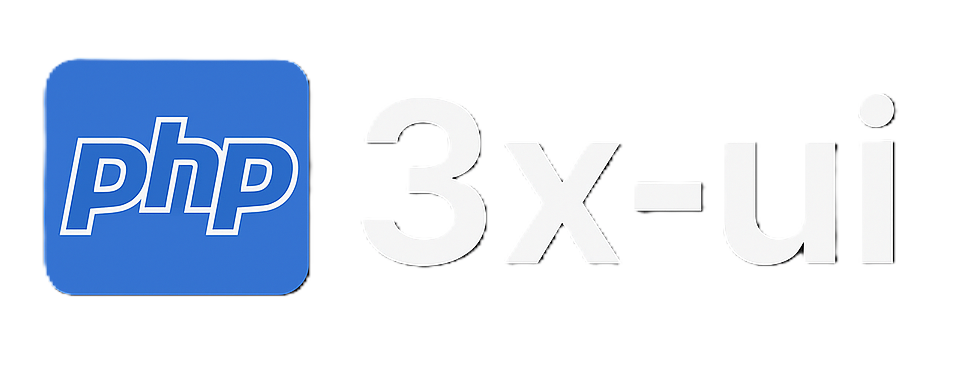

<p align="right" style="font-size: 0.8em;"><em>💡 Tip: Use the filter headings menu (top-right) to jump between sections.</em></p>

# An easy to use php library for [3x-ui](https://github.com/MHSanaei/3x-ui)

<p align="center">
  <picture>
    <source media="(prefers-color-scheme: dark)" srcset="./media/php_3x-ui.png">
    
  </picture>
</p>

[](https://www.php.net/releases/8.2/en.php)
[](https://github.com/MHSanaei/3x-ui/releases/tag/v2.4.8)
[](https://github.com/XTLS/Xray-core/releases/tag/v24.11.21)
[](https://github.com/es-taheri/3x-ui/releases/latest)
[](https://github.com/es-taheri/3x-ui/blob/master/LICENSE)

### PHP 3X-UI

**Simple open-source PHP library for managing MHSanaei 3x-ui panel without its official rest api.**

> [!IMPORTANT]\
> This library is only for personal using, please do not use it for illegal purposes, please do not use it in a
> production environment.

## Quick Start

* Require library in your project 📁

```
composer require estaheri/3x-ui
```

* Require composer autoload in your php code ⚓

```php
require_once __DIR__.'/vendor/autoload.php';
```

* Instantiating `Xui` class and set connection credentials 📡

```php
$xui = new Xui($xui_host, $xui_port, $xui_path, $xui_ssl);
```

* Login to panel using username & password 🔐

```php
$xui->login($username, $password);
```

* Now you can do anything ✅

```php
$xui->server; // Accessing to server methods (Status,Database,Stop/Restart Xray,...)
$xui->xray; // Accessing to xray methods (Inbounds,Outbounds,Routing,...)
$xui->panel; // Accessing to panel methods (Restart panel,Update/Get settings,...)
```

## Full Documentation (Not completed!)

[New Xui](#new-xui)

* [Login](#login)
* [Random](#random)
* [Uuid](#uuid)

[Xray](#xray)

* [Inbound](#inbound)
* [Outbound](#outbound)
* [Routing](#routing)
* [Reverse](#reverse)
* [Configs](#configs)
* [Restart](#restart)

[Server](#server)

* [Status](#status)
* [Database](#database)
* [Xray-Start-Stop](#xray-start-stop)
* [Xui-log](#xui-log)

[Panel](#panel)

* [Settings](#settings)
* [Restart](#restart)
* [Default-Xray-Config](#default-xray-config)

### New Xui

Instantiating `Xui` class for creating connection to 3x-ui

```php
$xui = new \XUI\Xui($host, $port, $uri_path, $has_ssl, $cookie_dir, $timeout, $proxy, $output, $response_output);
#---------------------------------------------------------------------------------
$host = 'localhost'; // Host address of 3x-ui panel. (Accepts Domain/Subdomain/Ipv4)
$port = 12345; // Port of 3x-ui panel. (1-65535)
$uri_path = '/'; // URI path of 3x-ui panel.
$has_ssl = false; // Does panel has SSL. (Default: FALSE)
$cookie_dir = __DIR__ . '/.cookie'; //
$timeout = 10; // HTTP Requests timeout
$proxy = null; // HTTP Requests proxy
$output = \XUI\Xui::OUTPUT_OBJECT; // Type of return value of methods. Use Xui::OUTPUT_xxx to set. (Accepts json,object,array)
$response_output = \XUI\Xui::OUTPUT_OBJECT; // Type of response value of requests. Use Xui::OUTPUT_xxx to set. (Accepts json,object,array)
```

- #### Login

After instantiating `Xui` class must use this method to login to panel.
> [!Note]
> Library automatically use cookie if login recently

```php
$xui->login($username,$password);
#---------------------------------------------------------------------------------
$username = 'admin'; // Panel login username
$password = 'xxxx'; // Panel login password
```

- #### Random

An static method for generating random string

```php
\XUI\Xui::random($length);
$length = 32; // Length of random string
```

- #### Uuid

An static method for generating random uuid useful to set inbound/outbounds clients uuid

```php
\XUI\Xui::uuid();
```

### Xray

A property to accessing Xray configs including Inbound,Outbound,Routing,Reverse,Others and restarting xray-core.

```php
$xray = $xui->xray;
```

- #### Inbound

A property to accessing Xray configs **inbounds**.

```php
$inbound = $xray->inbound;
```

##### Methods :

```php
# Add,Delete,Update,Get,Exist inbound
$inbound->add($config, $remark, $total_traffic, $expiry_time, $download, $upload, $enable);
$inbound->exist($inbound_id);
$inbound->get($inbound_id);
$inbound->update($inbound_id, $config, $remark, $total_traffic, $expiry_time, $download, $upload, $enable);
$inbound->delete($inbound_id);
# List,Online inbounds
$inbound->onlines();
$inbound->list();
# Import,Export inbound
$inbound->export($inbound_id);
$inbound->import($exported_inbound);
# Get,Clear client ips of inbound
$inbound->get_client_ips($client_email);
$inbound->clear_client_ips($client_email);
$inbound->reset_client_traffic($inbound_id, $client_email);
#---------------------------------------------------------------------------------
$config = new \XUI\Xray\Inbound\Protocols\Vmess\Vmess(); // Configured protocol object oriented class 
$config->settings->add_client();
$config->stream_settings->ws_settings(false, '/');
$inbound_id = 123; // ID of inbound
$remark = 'Me'; // Name of inbound
$total_traffic = 100 * \XUI\Xui::UNIT_GIGABYTE; // Total traffic of inbound. (Unit: Byte)
$download = 10 * \XUI\Xui::UNIT_GIGABYTE; // Download traffic usage of inbound. (Unit: Byte)
$upload = 500 * \XUI\Xui::UNIT_MEGABYTE; // Upload traffic usage of inbound. (Unit: Byte)
$enable = true; // Enable/Disable inbound
$expiry_time = time() + (30 * 86400); // Expiry time of inbound. (Unit: unix timestamp in seconds)
$exported_inbound = 'json'; // Json encoded exported inbound.
$client_email = 'client1234@localhost'; // Client email on inbound
```

- #### Outbound

A property to accessing Xray configs **outbounds**.

```php
$outbound = $xray->outbound;
```

##### Methods :

```php
# Add,Delete,Update,Get,Exist outbound
$outbound->add($tag,$config,$proxy_settings,$send_through,$mux);
$outbound->exist($outbound_tag);
$outbound->get($outbound_tag);
$outbound->update($outbound_tag, $tag, $config, $proxy_settings, $send_through, $mux);
$outbound->delete($outbound_tag);
# List outbound
$outbound->list();
#---------------------------------------------------------------------------------
$config = new \XUI\Xray\Outbound\Protocols\Vmess\Vmess(); // Configured protocol object oriented class 
$config->settings->add_user(\XUI\Xui::uuid());
$config->stream_settings->ws_settings(false);
$tag = 'vmess-test'; // The identifier of this outbound connection
$proxy_settings = null; // The outbound proxy configuration.
$send_through = '0.0.0.0'; // The IP address used to send data.
$mux = []; // Specific configuration related to Mux.
$outbound_tag = 'vmess-test'; // The identifier of this outbound connection
```

- #### Routing

A property to accessing Xray configs **routing**.

```php
$routing = $xray->routing;
$loaded = $routing->load();
if($loaded)
    echo "ok";
else
    echo 'error';
```

> [!Note]
> Before using routing methods must call `load()` method to load routing configs from xray config!

##### Methods :

```php
# Set/Get routing domain strategy,domain matcher,balancers
$routing->domain_strategy();
$routing->domain_matcher();
$routing->balancers();
# Add,Delete,Update,Get,Exist routing rule
$routing->has_rule($rule_inbound_tag,$rule_outbound_tag);
$routing->add_rule($rule,$apply);
$routing->get_rule($rule_inbound_tag,$rule_outbound_tag);
$routing->update_rule($rule_inbound_tag,$rule_outbound_tag,$rule,$apply);
$routing->delete_rule($rule_inbound_tag,$rule_outbound_tag,$apply);
# Apply changes made to routing
$routing->update();
#---------------------------------------------------------------------------------
$rule_inbound_tag = ['inbound-12345','inbound-12346']; // An array where each item represents an identifier.
$rule_outbound_tag = 'direct'; // Corresponds to the identifier of an outbound.
$apply = true; // Apply changes to routing in xray config
$rule = new \XUI\Xray\Routing\Rule($inbound_tag,$outbound_tag); // Configured rule object oriented class
```

- #### Reverse
A property to accessing Xray configs **reverse**.

```php
$reverse = $xray->reverse;
$loaded = $reverse->load();
if($loaded)
    echo "ok";
else
    echo 'error';
```

> [!Note]
> Before using reverse methods must call `load()` method to load reverse configs from xray config!

##### Methods :

```php
# Add,Delete,Update,Get,Exist reverse portal
$reverse->has_portal($portal_tag);
$reverse->add_portal($tag,$domain,$apply);
$reverse->get_portal($portal_tag);
$reverse->update_portal($portal_tag,$tag,$domain,$apply);
$reverse->delete_portal($portal_tag,$apply);
# Add,Delete,Update,Get,Exist reverse bridge
$reverse->has_bridge($bridge_tag);
$reverse->add_bridge($tag,$domain,$apply);
$reverse->get_bridge($bridge_tag);
$reverse->update_bridge($bridge_tag,$tag,$domain,$apply);
$reverse->delete_bridge($bridge_tag,$apply);
# Apply changes made to reverse
$reverse->update();
#---------------------------------------------------------------------------------
$portal_tag = 'portal-1'; // The identifier for the portal
$bridge_tag = 'bridge-1'; // The identifier for the bridge
$tag = 'portal-1'; // The identifier for the portal/bridge
$domain = 'reverse.xui'; // A domain name.
$apply = true; // Apply changes to reverse in xray config
```

- #### Configs
- #### Restart

### Server

- #### Status
- #### Database
- #### Xray-Start-Stop
- #### Xui-log

### Panel

- #### Settings
- #### Restart
- #### Default-Xray-Config

## Special Thanks to

- [MHSanaei](https://github.com/MHSanaei)
- [alireza0](https://github.com/alireza0/)

## Support project

### Give Star ⭐

**If this library is helpful to you, you may wish to give it a STAR**

### Donate 💵

**Help me improve this library by a donate** ❤️

- TRX : `TXFE1je6Ed7fADvxAQXXo2g45eQtXvwith`
- TON : `UQDb44qyae9n0hmgay3Bs_oom6RR8cZbLF5_9UCei0q13T0b`
- USDT (TRON): `TCTyFGJVkCgruAYmvPpetF6jVybuZSpTg6`
- USDT (TRX): `UQBnnLMdbAH6Pq86lsH9jEySH-D5___ctqUFKiuBXnd74FTD`